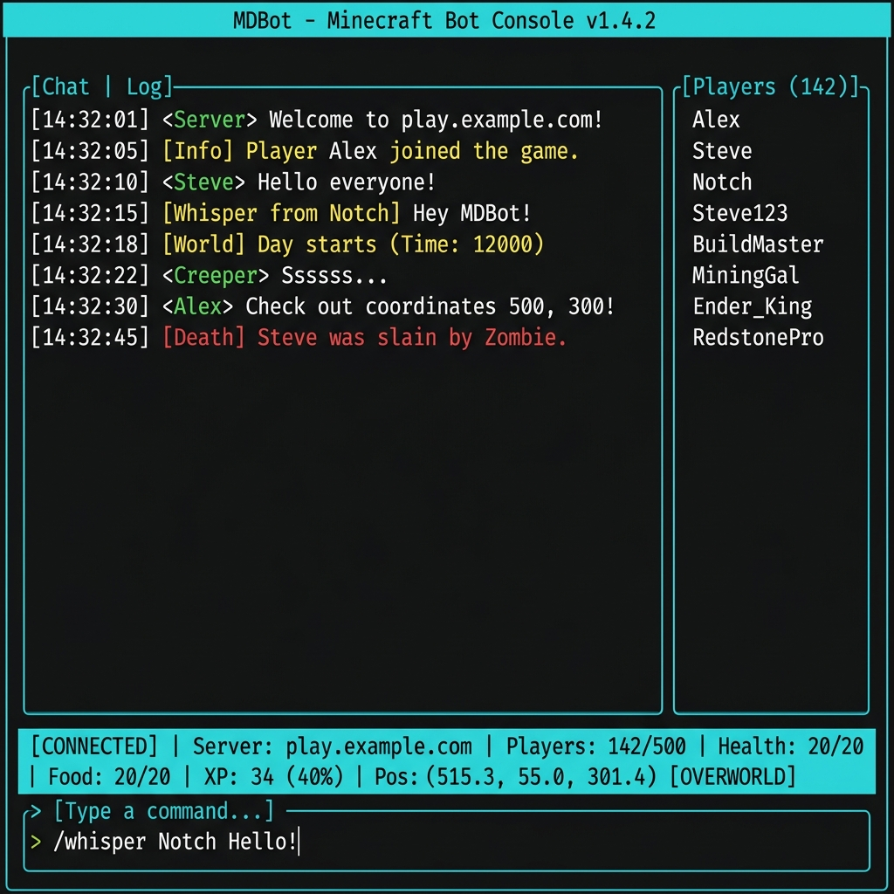

<div align="center">

# ⛏️ Minecraft AFK TUI

**A terminal-based AFK bot for Minecraft Java Edition with a beautiful TUI interface.**

Built with [Azalea](https://github.com/azalea-rs/azalea) · [Ratatui](https://github.com/ratatui/ratatui) · Rust 🦀

[](https://www.rust-lang.org/)
[](https://www.minecraft.net/)
[](LICENSE)



</div>

---

## ✨ Features

| Feature | Description |
|---------|-------------|
| 🖥️ **Interactive TUI** | Real-time chat panel, status bar, health/position monitoring |
| 🔐 **Dual Auth** | Offline (cracked) and Microsoft account support |
| 🤖 **Anti-AFK** | Walk, jump, and rotate automatically to avoid kick |
| 🔄 **Auto Reconnect** | Reconnect with configurable delay on disconnect |
| ⚡ **Auto Commands** | Execute login, server transfer, and custom commands on spawn |
| 📁 **Config File** | TOML configuration with hot-reload support |
| 🔌 **Proxy Support** | Works behind ViaProxy for cross-version play |
| 🎨 **Themes** | Dark and light color themes |

## 📦 Installation

### Prerequisites

- **Rust nightly** toolchain
  ```bash
  rustup toolchain install nightly
  ```
- **Git**

### Build from Source

```bash
git clone https://github.com/your-username/minecraft-afk-tui.git
cd minecraft-afk-tui

cargo build --release
```

The binary will be at `target/release/minecraft-afk-tui` (or `.exe` on Windows).

## 🚀 Quick Start

### Offline / Cracked Server

```bash
minecraft-afk-tui --server mc.server.com:25565 --username MyBot
```

### With Auto-Login (AuthMe/Login plugins)

```bash
minecraft-afk-tui \
  --server mc.server.com:25565 \
  --username MyBot \
  --login-password secretpass \
  --command "/server survival"
```

### Microsoft Account

```bash
minecraft-afk-tui --server mc.server.com:25565 --email your@email.com
```

### Simple Mode (No TUI)

```bash
minecraft-afk-tui --no-tui --server mc.server.com:25565 --username MyBot
```

## ⌨️ CLI Options

| Flag | Alias | Description | Default |
|------|-------|-------------|---------|
| `--server` | `-s` | Server address | `localhost:25565` |
| `--username` | `-u` | Username (offline mode) | `afk_bot` |
| `--email` | `-e` | Microsoft account email | — |
| `--login-password` | `-p` | Auto `/login` password | — |
| `--command` | — | Auto command on spawn (repeatable) | — |
| `--chat` | — | Auto chat message on spawn | — |
| `--reconnect-delay` | `-r` | Reconnect delay in seconds | `5` |
| `--view-distance` | `-v` | Client view distance (chunks) | `8` |
| `--config` | `-c` | TOML config file path | — |
| `--theme` | — | Color theme: `dark` or `light` | `dark` |
| `--no-tui` | — | Run in headless mode | `false` |
| `--help` | `-h` | Show help | — |

> **Note:** `--command` can be used multiple times. Execution order: login → commands → chat, each with a 3s delay.

## 🖥️ TUI Keybindings

### General

| Key | Action |
|-----|--------|
| `Ctrl+Q` / `Esc` | Quit application |
| `?` | Toggle help overlay |

### Input

| Key | Action |
|-----|--------|
| `Enter` | Send message or command |
| `↑` / `↓` | Navigate command history |
| `←` / `→` | Move cursor |
| `Home` / `End` | Jump to start / end |
| `PageUp` / `PageDown` | Scroll chat |

### Built-in Commands

Prefix with `/` like in Minecraft. Type normally to chat.

| Command | Action |
|---------|--------|
| `/quit` or `/exit` | Exit application |
| `/clear` | Clear chat panel |
| `/reconnect` | Force reconnect to server |
| `/status` | Show connection info |
| `/clear-errors` | Clear error logs |
| `/toggle-errors` | Show/hide error panel |

Any other `/command` (e.g. `/server vanilla`, `/warp afk`) is forwarded to the Minecraft server.

## 📁 Configuration

Create a `config.toml` for persistent settings:

```toml
server = "mc.server.com:25565"
username = "MyBot"
# email = "your@email.com"
# password = "loginpass"
reconnect_delay = 5
view_distance = 8

auto_commands = [
    "/login mypassword",
    "/server survival"
]

[theme]
name = "dark" # or "light"
```

```bash
minecraft-afk-tui --config config.toml
```

> Config file supports **hot-reload** — changes are applied without restarting.

## 🔌 ViaProxy Support

For servers running Minecraft versions newer than what Azalea supports (e.g. `1.21.5`), use [ViaProxy](https://github.com/ViaVersion/ViaProxy) as a protocol translator:

```bash
# 1. Start ViaProxy
java -jar ViaProxy.jar \
  --bind-address 0.0.0.0:25566 \
  --target-address mc.server.com:25565 \
  --version 1.21.11

# 2. Connect bot to ViaProxy
minecraft-afk-tui --server 127.0.0.1:25566 --username MyBot
```

## 🏗️ Project Structure

```
minecraft-afk-tui/
├── src/
│   ├── main.rs          # Entry point & runtime setup
│   ├── app/             # TUI application loop & argument parsing
│   ├── bot/             # Azalea bot logic & event handling
│   ├── config/          # TOML config & hot-reload watcher
│   ├── core/            # Shared types, events, state machine
│   └── ui/              # TUI components (chat, status, input, modal)
├── Cargo.toml
└── config.toml          # Example configuration
```

## 🔧 Development

```bash
# Development build
cargo build

# Release build (optimized)
cargo build --release

# Run directly
cargo run -- --server localhost:25565 --username dev_bot

# With debug logging
set RUST_LOG=debug && cargo run -- --server localhost:25565 --username dev_bot
```

## ❓ Troubleshooting

<details>
<summary><b>Bot keeps getting disconnected</b></summary>

- Increase `--reconnect-delay` to avoid rate limiting
- Make sure the username isn't already online
- Check if the server supports your Minecraft version

</details>

<details>
<summary><b>Can't connect to server</b></summary>

- Verify server address and port
- Check firewall settings
- For 1.21.5+ servers, use ViaProxy (see above)

</details>

<details>
<summary><b>"You are already online!" error</b></summary>

- Wait a few seconds before reconnecting — the proxy needs time to clear the old session
- Increase `--reconnect-delay`

</details>

<details>
<summary><b>spawn_local called from outside of a LocalSet</b></summary>

This is handled internally. If you encounter it, please open an issue.

</details>

## 📄 License

This project is licensed under the [MIT License](LICENSE).

## 🤝 Contributing

Contributions are welcome! Please open an issue first to discuss significant changes.

